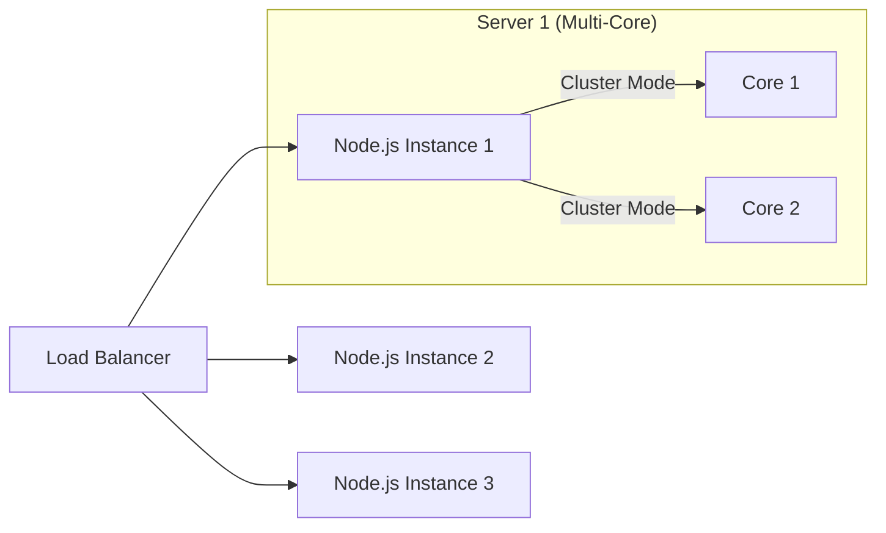

# Application Tier: Scaling & Load Balancing

Scaling the application tier focuses on handling more concurrent users by adding more processing units.

## 1. Scaling Flow

## 2. Statelessness: The Golden Rule
For horizontal scaling to work, the application server **must not remember the user**.
*   **Session Management:** Instead of `req.session` (local memory), use **JWT** or **Redis-backed sessions**.
*   **File Storage:** Instead of saving images to `./uploads`, use **S3** or **Google Cloud Storage**.
*   **Local Variables:** Never use global variables to store state (e.g., a counter `let clicks = 0`). Use Redis `INCR`.

## 3. Load Balancing Algorithms
1.  **Round Robin:** Sequential distribution. Best for identical server hardware.
2.  **Least Connections:** Sends traffic to the server with the fewest active sessions. Best for long-running requests.
3.  **IP Hashing:** Uses client IP to ensure a user always hits the same server. Useful for legacy apps that require "Sticky Sessions."

## 4. Edge Cases & Solutions

| Edge Case | Description | Possible Solution |
| :--- | :--- | :--- |
| **Sticky Session Failure** | A user is tied to Server A, but Server A crashes. | **Centralized Session Store:** Use Redis for sessions so any server can pick up where Server A left off. |
| **Health Check Latency** | A server is slow but not "dead," so the LB keeps sending traffic. | **Dynamic Health Checks:** Set lower timeout thresholds for health checks and use "Least Response Time" balancing. |
| **Thundering Herd** | All servers restart at once and try to connect to the DB, crashing it. | **Jitter:** Add random delays to server startup and connection attempts. |
