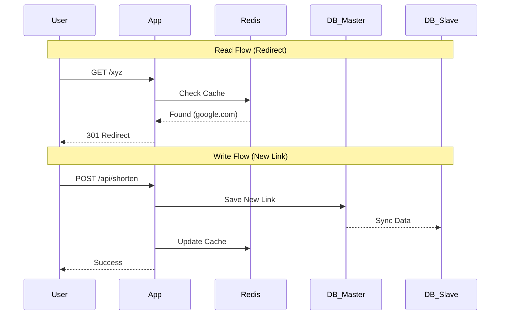

# Data Strategy: Caching & Database Architecture

This document covers how we handle massive amounts of data and high-speed writes for analytics.

## 1. The Data Flow (Read vs Write)

## 2. Redis Usage
### A. URL Caching
*   **Strategy:** Cache-Aside.
*   **TTL:** 24 Hours.
*   **Eviction:** Least Recently Used (LRU).

### B. Analytics Buffering (Write-Back)
Instead of updating MySQL for every click:
1.  `redis.incr("clicks:abc")`
2.  Background worker runs every 5 minutes.
3.  `UPDATE URLs SET totalVisits = totalVisits + N WHERE id = 'abc'`

## 3. Database Scaling
*   **Master-Slave Replication:** 1 Master for writes, N Slaves for reads.
*   **Sharding:** If the Master is overwhelmed, we split the database by `user_id` or `short_id` hash across multiple Master servers.

## 4. Edge Cases & Solutions

| Edge Case | Description | Possible Solution |
| :--- | :--- | :--- |
| **Cache Stampede** | A popular link expires in Redis, and 10,000 requests hit the DB at once. | **Probabilistic Early Recomputation:** Re-cache the item *before* it expires if it's being accessed frequently. |
| **Replication Lag** | Data is written to Master but hasn't reached the Slave when the user refreshes. | **Primary Read Path:** Force a read from the Master immediately after a write for that specific user. |
| **Hot Key Issue** | One specific link (e.g., a Super Bowl ad) is so popular it overwhelms even Redis. | **Local Cache Layer:** Add a 1-second in-memory cache on the App Server itself for extremely popular keys. |
| **Dirty Cache** | DB is updated but Redis still has the old URL. | **Cache Invalidation:** Always `redis.del(key)` or `redis.set(key)` immediately after a DB update. |
