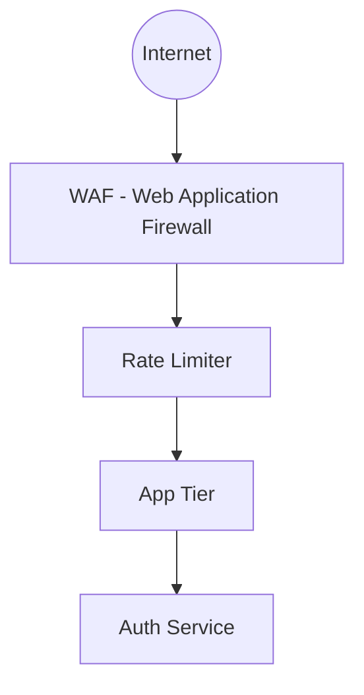

# Security & Reliability: Defending the System

A scaled system is a target. This document covers protection against attacks and failures.

## 1. The Security Layer

## 2. Key Protection Strategies
### A. Rate Limiting
*   **Implementation:** Using Redis Fixed Window or Token Bucket.
*   **Purpose:** Prevent a single user/bot from spamming the "Create Link" API.
*   **Rule:** 10 links per minute per IP address.

### B. DDoS Protection
*   **Layer 7 Protection:** CDNs (like Cloudflare) filter out bot traffic before it hits your servers.
*   **IP Blacklisting:** Automatically block IPs that show suspicious behavior.

### C. Data Integrity
*   **ID Collisions:** When using short IDs (e.g., `6vB8z`), there is a tiny chance two links get the same ID.
*   **Solution:** Use a 7-character base62 string (3.5 trillion combinations) and add a `UNIQUE` constraint in MySQL.

## 3. Disaster Recovery
1.  **Database Backups:** Automated snapshots every 6 hours stored in a different geographical region.
2.  **Point-In-Time Recovery (PITR):** The ability to restore the database to any specific second in the last 30 days.
3.  **Circuit Breakers:** If the Database is timing out, the App Server stops trying for 30 seconds to let the DB recover, returning a "Service Unavailable" message instead of crashing.

## 4. Edge Cases & Solutions

| Edge Case | Description | Possible Solution |
| :--- | :--- | :--- |
| **Malicious Redirects** | Users shorten links to phishing or malware sites. | **Safe Browsing API:** Check the destination URL against a blacklist (like Google Safe Browsing) before shortening. |
| **Zombie Connections** | Thousands of half-open connections (Slowloris attack) eat up server memory. | **Connection Timeout:** Set strict timeouts for idle connections at the Load Balancer level. |
| **Cascading Failure** | Server A fails, so Server B gets its traffic and fails, then Server C fails. | **Automatic Shedding:** If a server's CPU hits 95%, it should stop accepting new connections to protect itself. |
