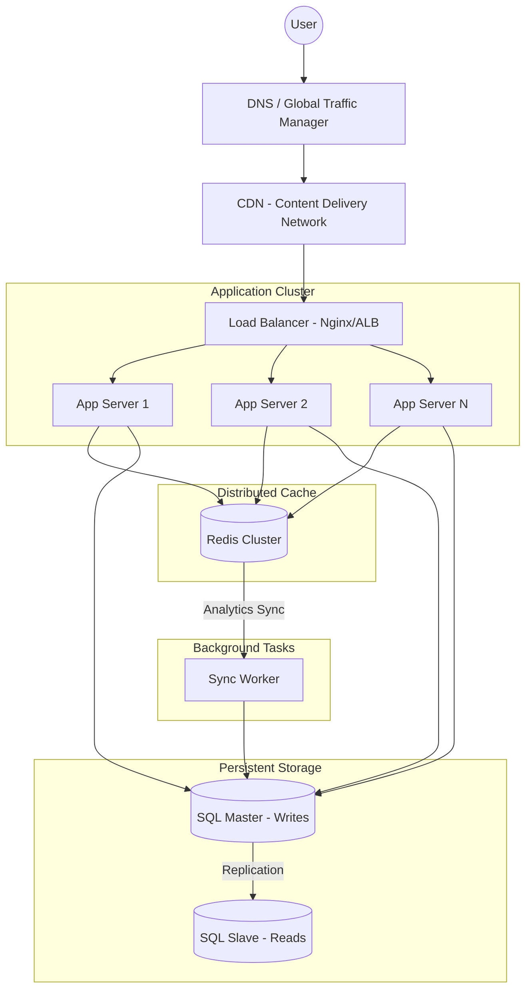

# System Design: Global URL Shortener Overview

This document outlines the high-level architecture designed to support millions of users with sub-millisecond latency.

## 1. High-Level Architecture Diagram
The system is built on a multi-tier, distributed architecture to ensure no single point of failure.

## 2. Core Components
*   **Traffic Management:** DNS and CDNs handle the initial user request, routing it to the nearest geographical data center.
*   **Load Balancing:** Distributes incoming HTTP requests across a pool of application servers using algorithms like Round Robin or Least Connections.
*   **Stateless Services:** Application servers process logic without storing user data in memory, allowing for infinite horizontal scaling.
*   **Caching Layer:** Uses Redis to store high-frequency data (URLs and analytics counters) in RAM.
*   **Data Tier:** A Master-Slave database configuration ensures data persistence and fast read performance.

## 3. Edge Cases & Solutions

| Edge Case | Description | Possible Solution |
| :--- | :--- | :--- |
| **Sudden Traffic Spike** | A link goes viral on social media. | **Auto-Scaling:** Automatically spin up more App Servers and increase Redis capacity. |
| **Data Center Outage** | An entire physical region (e.g., AWS us-east-1) goes down. | **Multi-Region Deployment:** Route traffic to a secondary region (e.g., us-west-2) via DNS. |
| **System Version Mismatch** | Different servers running different versions of the code during deployment. | **Rolling Updates:** Update one server at a time and ensure backward compatibility in the DB schema. |
