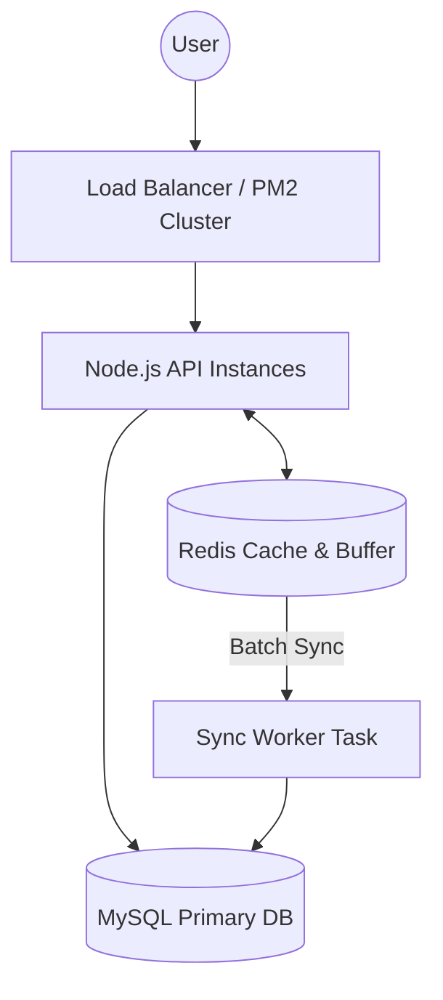
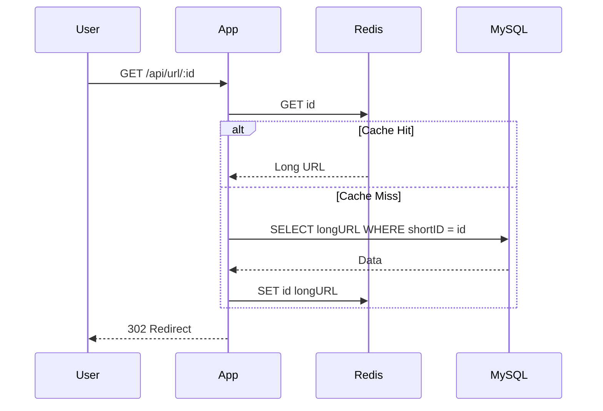

# High-Performance URL Shortener: System Design Study

This document provides a deep-dive analysis into the architecture of the URL Shortener project, explaining the scaling patterns, caching strategies, and data consistency models used to handle high-concurrency traffic.

## 1. System Architecture Overview

The system is designed with a **stateless application tier**, a **high-speed caching tier**, and a **persistent storage tier**.

---

## 2. Core Scaling Patterns

### A. Cache-Aside Strategy (Read Optimization)
To handle massive redirection traffic, we use the **Cache-Aside** pattern. Instead of querying MySQL for every redirect, we use Redis as a high-speed lookaside.

**The Workflow:**
1. **Check Cache:** The app checks Redis for the `shortID`.
2. **Cache Hit:** If found, redirect immediately (0.1ms).
3. **Cache Miss:** If not found, query MySQL.
4. **Update Cache:** Save the result in Redis for the next user.

### B. Write-Back Buffering (Analytics Optimization)
Writing "Click Analytics" to a disk-based database (MySQL) on every click is a bottleneck. We use a **Write-Back Buffer** strategy.

1. **Increment in Redis:** Every click triggers `INCR clicks:id` in Redis. This is an atomic operation in memory.
2. **Delayed Sync:** Every 6 minutes, a background task (`flushClicksToDB`) fetches these counts and performs a **batch update** in MySQL.

**Benefit:** This reduces MySQL write load by 90% or more depending on traffic density.

---

## 3. Security: Distributed Rate Limiting

To prevent API abuse (e.g., a bot creating millions of links), we implemented **Rate Limiting** using `express-rate-limit` and `rate-limit-redis`.

*   **Mechanism:** Sliding Window.
*   **Storage:** Redis stores the "Credit" of each IP address.
*   **Configuration:** 5 requests per minute per IP.
*   **Why Redis?** If we have 10 servers running (Clustering), they all share the same Redis counter. A user cannot bypass the limit by hitting a different server instance.

---

## 4. Data Consistency & Durability

| Component | Strategy | Note |
| :--- | :--- | :--- |
| **URL Mapping** | Strong Consistency | Written to MySQL first, then cached in Redis. |
| **Analytics** | Eventual Consistency | Accurate in Redis immediately; accurate in MySQL after sync. |
| **Availability** | High | Redis is highly available; App is clustered via PM2. |

---

## 5. Implementation Details

### Database Schema
We use two normalized tables in MySQL via Sequelize:
1. **Urls:** Stores the mapping (`id`, `longURL`, `shortID`).
2. **Analytics:** Stores traffic data (`totalVisits`, `UrlId`).

### Key Technologies
*   **Node.js & Express:** The application runtime.
*   **Sequelize ORM:** For structured database interactions.
*   **ioredis:** A robust Redis client for Node.js.
*   **PM2:** For process management and CPU core utilization.

---

## 6. Future Scaling Roadmap

1. **Database Replication:** Moving to a Master-Slave setup to offload read queries to multiple replicas.
2. **Content Delivery Network (CDN):** For the frontend to ensure global low-latency.
3. **Geographic Sharding:** Distributing data based on the user's region (e.g., US data in US-East, Asia data in Mumbai).

---
*Documentation generated for System Design Study - May 2024*
