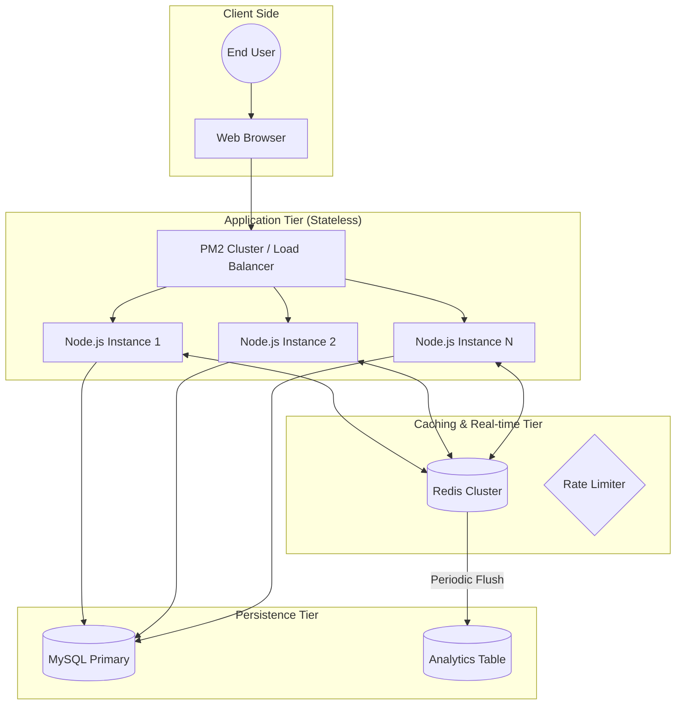
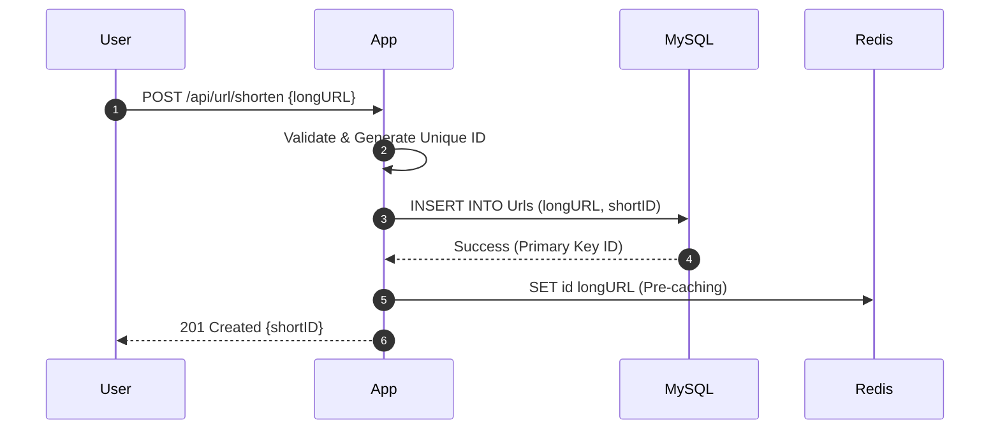
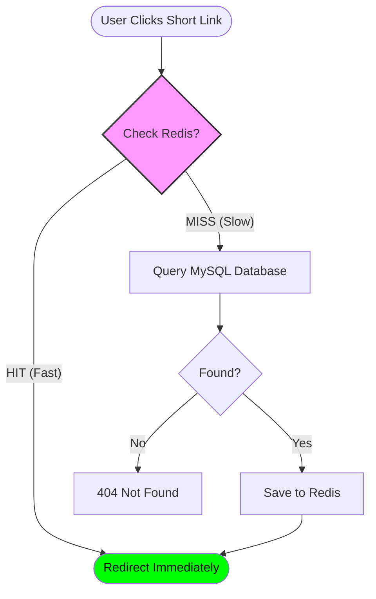
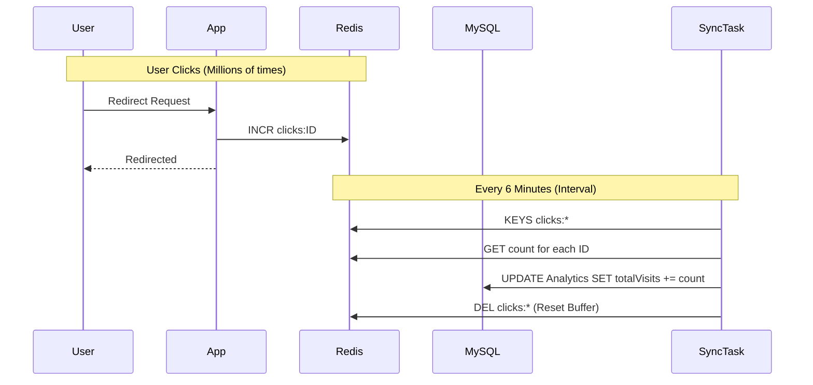
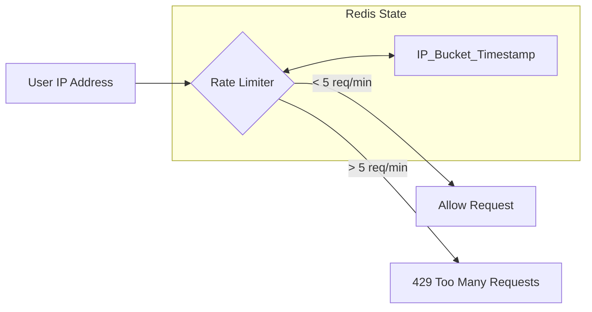
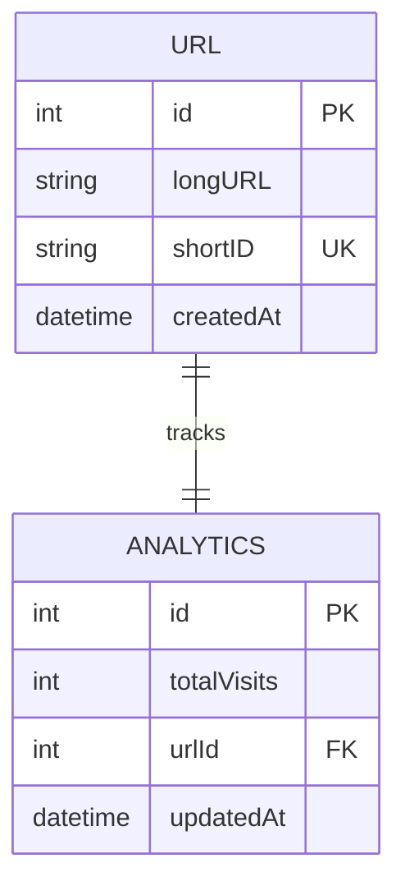

# High-Performance URL Shortener: System Design Study

This document provides a deep-dive analysis into the architecture of the URL Shortener project, explaining the scaling patterns, caching strategies, and data consistency models used to handle high-concurrency traffic.

---

## 1. High-Level System Architecture

The system uses a **multi-tier architecture** designed for horizontal scalability and sub-millisecond response times.

---

## 2. The "Write Path" (URL Creation)

When a user creates a shortened URL, we prioritize **Data Integrity** over raw speed. We write to the database first, then propagate to the cache.

---

## 3. The "Read Path" (High-Speed Redirect)

This is the most critical path. It uses the **Cache-Aside** pattern to minimize database latency.

---

## 4. Analytics Buffering (Write-Back Pattern)

Instead of updating the database on every click, we "buffer" increments in Redis and sync them in batches.

---

## 5. Security Architecture (Rate Limiting)

We use a distributed sliding window algorithm to prevent API abuse.

---

## 6. Database Schema Design (ER Diagram)

The relationship between URLs and their analytics is **1:1** or **1:N** depending on the granularity required.

---

## 7. Reliability: Failure Mode Analysis

| Component Failure | Impact | Mitigation Strategy |
| :--- | :--- | :--- |
| **Redis Down** | Slow Response | App falls back to MySQL for all reads/writes. |
| **MySQL Down** | Outage | Read-only mode can be enabled if Redis is alive. |
| **App Node Crash** | Minimal | PM2 automatically restarts the process on other cores. |

---
*Prepared by Antigravity AI for Project Scale-Up - May 2024*
